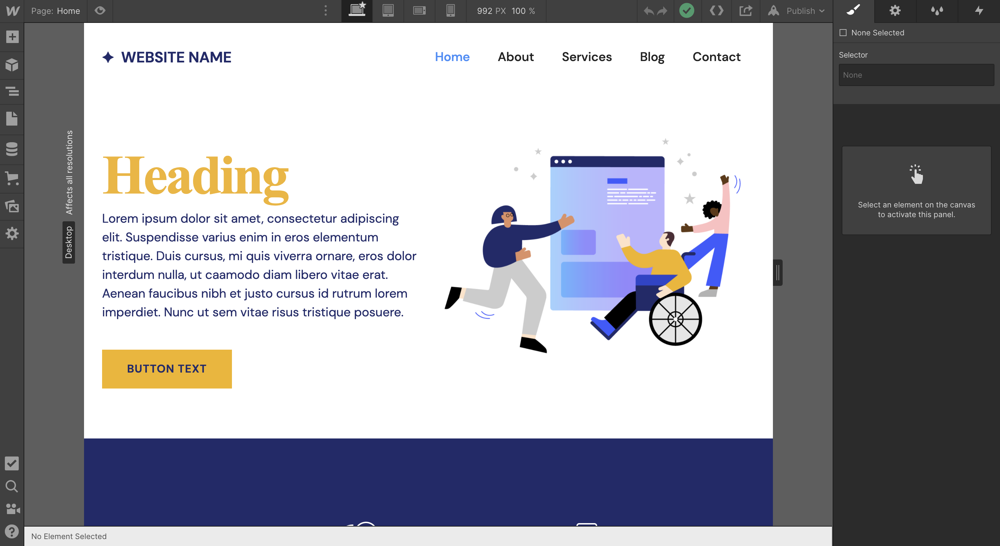
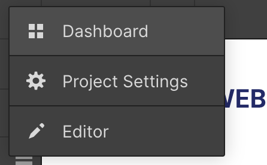
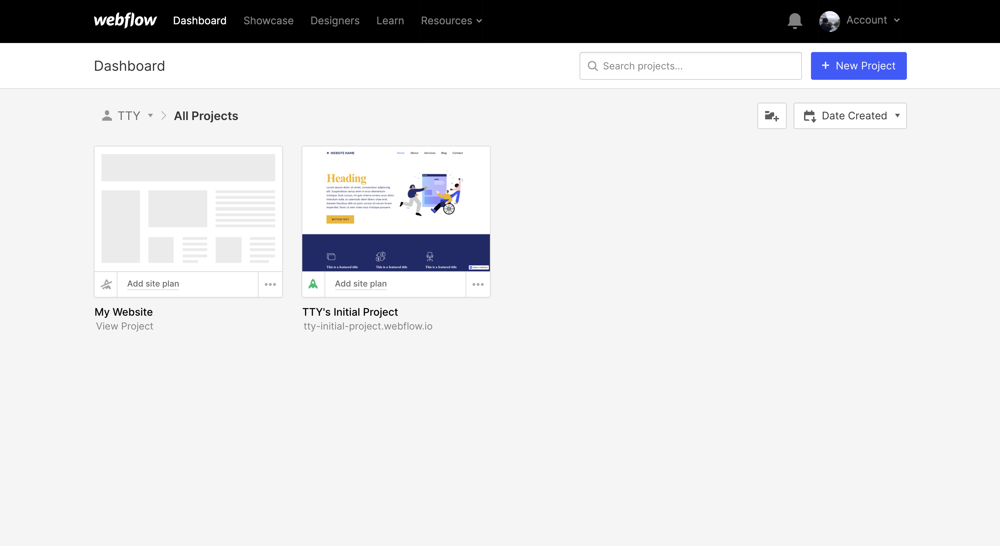
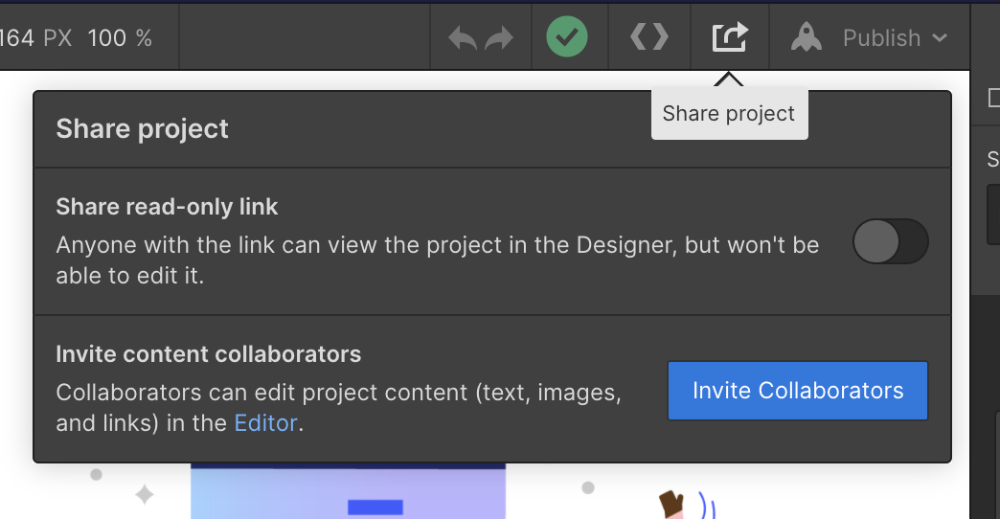

# Basic - webflowの使い方を学ぶ

ダッシュボードのプロジェクトを開くと、上のような画面になるはずである。この章では画面の説明とその使い方について解説する。

画面構成としては

- 左側にパーツ等を設置するツールバー
- 真ん中にキャンバス(プレビュー)
- 右側にスタイル設定のインスペクタパネル

となっている。それぞれの説明は以下。

## ツールバー
ツールバーでは様々な設定やパーツの指定が可能である。
### Menu

#### ダッシュボード

ダッシュボードではプロジェクト一覧が閲覧可能
#### Project Settings
プロジェクトセッティングではプロジェクトに関する様々な設定が可能である。例えば

- Fabicon
- SEO
- ホスティング設定
- フォーム設定
- 請求
- バックアップ
- アナリティクスやAPIの設定

が可能である。
#### Edit
視覚的に文字やリンク等の簡単な設定が可能である。

### Add
キャンバスに設置できるテンプレートやあらかじめ設定されたエレメント、**シンボル**の設定が可能。

### Navigation
エレメントの親子関係の確認に用いる。

### Pages
プロジェクト全体に存在するページが表示され、それらを管理できる。

### CMS
データベースを持つようなプロジェクトを作るときに活用する。

### Eコマースメニュー
ECを構築するときに活用する。

### Assets
プロジェクトで使う画像等を管理できる。

### Settings
- Search
 - CMSデータの検索ができる
- Backups
 - このプロジェクトの保存履歴を管理できる。バージョン管理が可能なタブであり、有料プランだとより過去に遡って編集ができる。

## キャンバス
キャンバスではPCだけでなく、タブレットやスマートフォン等のレスポンスブなデザイン、パーツの配置も確認する事ができる。また、プレビューを行ったり、コードをエクスポートしたり、

このようにプロジェクトの共有設定やコラボレータ設定が可能。
その他にもドメイン設定や公開設定等もこのキャンバス上部のツールバーで可能である。

## インスペクタパネル
右側の画面は

- Style
- Element Setting
- Style Manager
- Interaction

の4つのタブで構成されている。

StyleとEleemntSettingタブについてはそれぞれのエレメントの設定項目が表示され、StyleManagerタブには利用されているクラス等が管理できるような項目が表示される。Interactionタブはアニメーションの設定ができる。